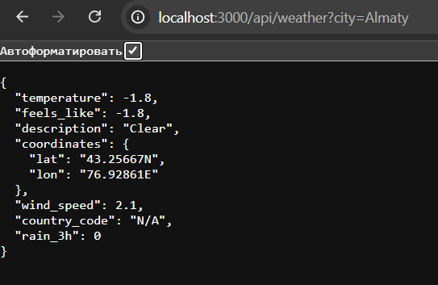
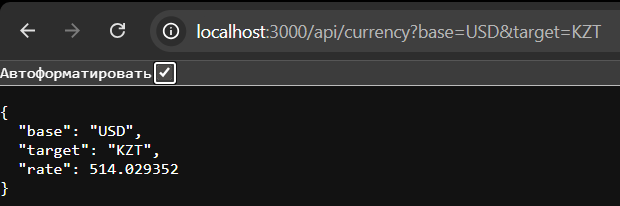

## Assignment 2 — Backend API Integration & Service Development
## Student: Sadykov Danial 

## 1. Objective

the goal is to build a backend that fetches and processes external API data. the project demonstrates server side integration with:

- Weather API (Meteosource)  
- Currency API (exchangerate.host)  

all API calls are handled on the server side to provide a clean and secure interface for the frontend or Postman testing

## 2. Project Structure
```
assignment2/
├─ app.js
├─ package.json
├─ routes/
│ ├─ weather.js
│ └─ currency.js
└─ services/
  ├─ weatherService.js
  └─ currencyService.js
```

- `routes/` — defines API endpoints.  
- `services/` — handles external API requests and processes JSON.  

## 3. Setup Instructions

## API Usage
### Weather API

Endpoint: /api/weather

Method: GET

Query parameter: city (e.g., almaty)

### Example Request:

GET http://localhost:3000/api/weather?city=almaty

Response:

```json
{
  "temperature": -1.8,
  "feels_like": -1.8,
  "description": "Clear",
  "coordinates": { "lat": "43.25667N", "lon": "76.92861E" },
  "wind_speed": 2.1,
  "country_code": "N/A",
  "rain_3h": 0
} 
```
### Currency API
Endpoint: /api/currency

Method: GET

Query parameters:

base (default: USD)

target (default: KZT)

Example Request:

```bash
GET http://localhost:3000/api/currency?base=USD&target=KZT
```
Response:

```json
{
  "base": "USD",
  "target": "KZT",
  "rate": 514.029352
}
```

## Screenshots
### Weather API HTTP Example



### Currency API HTTP Example



## Conclusion
Successfully integrated two server-side APIs.
Backend architecture separates routes and services.

